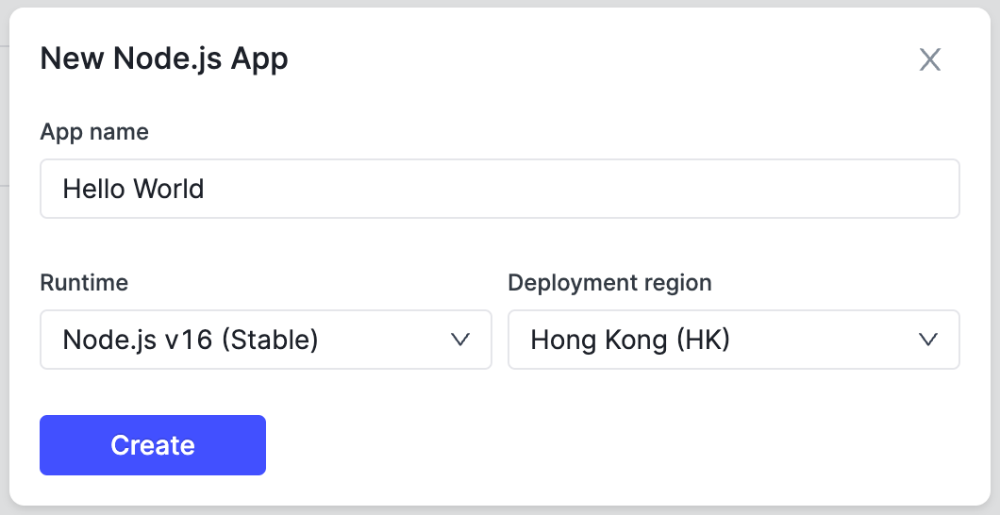
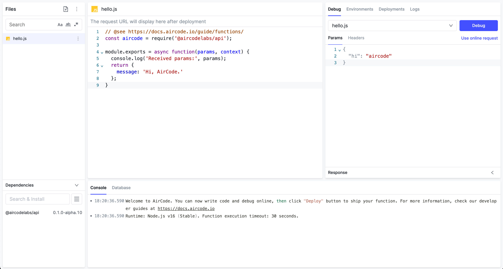
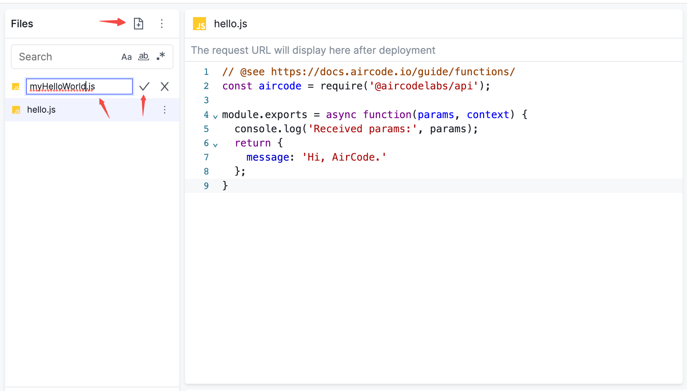

# Quick Start {#intro}

This is a 5-minute onboarding tutorial for developers who are new to AirCode. Through this tutorial, you will learn:
1. Create an AirCode application, develop and debug cloud functions online
2. Deploy a Hello World online API, which can be invoked directly through HTTP

We have provided an example that you can run directly. Click "Run", and you will see the result of the function in below example.

<iframe src="https://codesandbox.io/embed/hungry-chatterjee-c2yyux?fontsize=14&hidenavigation=1&theme=light"
  style="width:100%; height:500px; border:0; border-radius: 4px; overflow:hidden;"
  title="hungry-chatterjee-c2yyux"
  allow="accelerometer; ambient-light-sensor; camera; encrypted-media; geolocation; gyroscope; hid; microphone; midi; payment; usb; vr; xr-spatial-tracking"
  sandbox="allow-forms allow-modals allow-popups allow-presentation allow-same-origin allow-scripts"
></iframe>

## Create an App {#create-an-app}

Sign up and log in to [AirCode Dashboard](https://aircode.io/dashboard), click "+ New Node.js App", and enter the app name in the pop-up window to create an App.

> Here we create an App called `Hello World`.



After the creation, it will automatically jump to the created App page, where you can complete the development, debugging and deployment.



## Create a Function {#create-a-function}

Every new application will have a cloud function named `hello.js` by default, or you can create your own functions. Click the "+" button, enter your function's name, and click "✓" to finish the creation.

> Here we create a cloud function named `myHelloWorld.js`.



The created function will contain an initial piece of code.

```js
const aircode = require('aircode');

module.exports = async function(params, context) {
  console.log('Received params:', params);
  return {
    message: 'Hi, AirCode.'
  };
}
```

## Debug a Function {#debug}

AirCode provides an easy-to-use online debug tool for functions, allowing you to see the running results and modify the code at any time during the development.

First, modify the function as follows:

```js{7}
const aircode = require('aircode');

module.exports = async function(params, context) {
  console.log('Received params:', params);
  // Return the payload passing by params
  return {
    message: params.payload,
  };
}
```

In the "Debug" area on the right, modify the content of the "Params" to the following JSON string:

```json
{
  "payload": "Hello, Micheal!"
}
```

Click the "Debug" button to send the request to the function `myHelloWorld.js`. At this time, the JSON string of the "Params" will be passed to the function as a parameter, and can be obtained in the function through the `params` field.

You can see the return message of the function in the "Response" area:

```json
{
  "message": "Hello, Micheal!"
}
```

In the "Console" area, you can see the log output through `console.log` when the function is running:

```
18:24:30.237 Received params: { payload: 'Hello, Micheal!' }
```


## Deploy a Function {#deploy}

When finishing the development, we just need to deploy it, and then we can invoke it in reality.

Click the "Deploy" button in the top bar, keep the options in the pop-up window unchanged, and click "Deploy".


After the deployment is successful, an online URL of the function will appear below the function name. Click to copy it to the clipboard.

This URL can be accessed directly through the browser. To pass parameters, just add params in the form of `?key=value` to the URL, e.g:

```
https://sample.hk.aircode.run/myHelloWorld?payload=hello
```

Or directly check out our runnable example:

<iframe src="https://codesandbox.io/embed/hungry-chatterjee-c2yyux?fontsize=14&hidenavigation=1&theme=light"
  style="width:100%; height:500px; border:0; border-radius: 4px; overflow:hidden;"
  title="hungry-chatterjee-c2yyux"
  allow="accelerometer; ambient-light-sensor; camera; encrypted-media; geolocation; gyroscope; hid; microphone; midi; payment; usb; vr; xr-spatial-tracking"
  sandbox="allow-forms allow-modals allow-popups allow-presentation allow-same-origin allow-scripts"
></iframe>

## What's Next? {#next}

Congratulations on developing and deploying your first cloud function, let's see how to access the database directly in the function.

<ListBoxContainer>
  <ListBox
    link="/getting-started/database.html"
    title="Introduction to Database"
    description="Follow this simple tutorial to learn how to do database operations with AirCode's cloud functions"
    single
  />
</ListBoxContainer>

Wish to know more about how to use cloud functions? check out [Cloud Function Overview](/guide/functions/).
