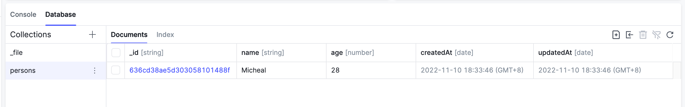

# 数据库入门 {#intro}

AirCode 提供了一套开箱即用的数据库功能，只需使用 `aircode.db` 即可在云函数中对数据进行存取操作。

## 学习目标 {#objectives}

- 学会使用 `const MyTable = aircode.db.table(tableName)` 获取表
- 学会使用 `await MyTable.save(records)` 保存记录
- 学会使用 `const records = await MyTable.where().find()` 查询记录
- 学会使用 `await MyTable.delete(records)` 删除记录

## 使用 `save` 插入新记录 {#insert}

调用 `save` 方法并传入一个对象或一个对象数组，可以插入新记录。

例如我们往 `persons` 表中插入一条 `name` 为 `'Micheal'`，`age` 为 `28` 的记录：

```js
const aircode = require('aircode');

module.exports = async function (params, context) {
  // Use `aircode.db.table` to get a table
  const PersonsTable = aircode.db.table('persons');
  // Use `save` to add a new record
  const result = await PersonsTable.save({
    name: 'Micheal',
    age: 28,
  });

  return {
    result,
  };
}
```

点击调试，可以在「Response」区域看到如下结果：

```json
{
  "result": {
    "_id": "636cd38ae5d303058101488f",
    "name": "Micheal",
    "age": 28,
    "createdAt": "2022-11-10T10:33:46.424Z",
    "updatedAt": "2022-11-10T10:33:46.424Z"
  }
}
```

代表新增记录成功了，其中 `_id`、`createdAt` 和 `updatedAt` 是系统自动生成的字段。

::: tip 提示
使用 `save` 插入记录时，不需要提前创建表，若该表不存在则 AirCode 会自动创建。
:::

在控制台下方的「Database」区域中，选中 `persons` 数据表，也可以看到新增的数据。



## 使用 `find` 查询记录 {#find}

通过 `where` 方法传入查询条件后，使用 `find` 可以获取到所有匹配的记录。

例如我们可以通过将上一步插入的记录查询出来：

```js
const aircode = require('aircode');

module.exports = async function (params, context) {
  // Use `aircode.db.table` to get a table
  const PersonsTable = aircode.db.table('persons');
  // Find all the records whose name is Micheal
  const result = await PersonsTable.where({ name: 'Micheal' }).find();

  return {
    result,
  };
}
```

点击调试，可以在「Response」区域看到如下结果：

```json
{
  "result": [
    {
      "_id": "636cd38ae5d303058101488f",
      "name": "Micheal",
      "age": 28,
      "createdAt": "2022-11-10T10:33:46.424Z",
      "updatedAt": "2022-11-10T10:33:46.424Z"
    }
  ]
}
```

::: tip 提示
除 `find` 外，也可以使用 `findOne` 来获取第一条匹配的记录。
:::

## 修改数据后再使用 `save` 更新记录 {#update}

查询出记录并修改其数据后，再使用 `save` 就可以完成更新操作。

让我们先查出名为 `Micheal` 的记录，并增加其年龄后保存更新：

```js
const aircode = require('aircode');

module.exports = async function (params, context) {
  // Use `aircode.db.table` to get a table
  const PersonsTable = aircode.db.table('persons');
  // Find the first one whose name is Micheal
  const micheal = await PersonsTable.where({ name: 'Micheal' }).findOne();
  // Add 1 year to his age
  micheal.age += 1;
  // Then save it
  const result = await PersonsTable.save(micheal);

  return {
    result,
  };
}
```

点击调试，可以在「Response」区域看到如下结果：

```json
{
  "result": {
    "_id": "636cd38ae5d303058101488f",
    "name": "Micheal",
    "age": 29,
    "createdAt": "2022-11-10T10:33:46.424Z",
    "updatedAt": "2022-11-10T10:36:25.430Z"
  }
}
```

代表数据库中的记录已经被更新了。

## 使用 `delete` 删除记录 {#delete}

调用 `delete` 方法并传入对象，可以将这条记录从数据库删除。

例如，我们将本示例中新增的记录删除：

```js
const aircode = require('aircode');

module.exports = async function (params, context) {
  // Use `aircode.db.table` to get a table
  const PersonsTable = aircode.db.table('persons');
  // Find the first one whose name is Micheal
  const micheal = await PersonsTable.where({ name: 'Micheal' }).findOne();
  // Delete it from the table
  const result = await PersonsTable.delete(micheal);

  return {
    result,
  };
}
```

点击调试，可以在「Response」区域看到如下结果：

```json
{
  "result": {
    "deletedCount": 1
  }
}
```

## 接下来 {#next}

恭喜你已经学会在 AirCode 中使用数据库的基本方式，接下来让我们看看如何通过一行代码上传文件。

<ListBoxContainer>
  <ListBox
    title="文件存储入门"
    link="/getting-started/files.html"
    description="一行代码上传文件，并得到一个 CDN 加速的访问地址"
    single
  />
</ListBoxContainer>

如果想了解更多和数据库相关的使用方法，可查看[数据库概览](/guide/database/)。
