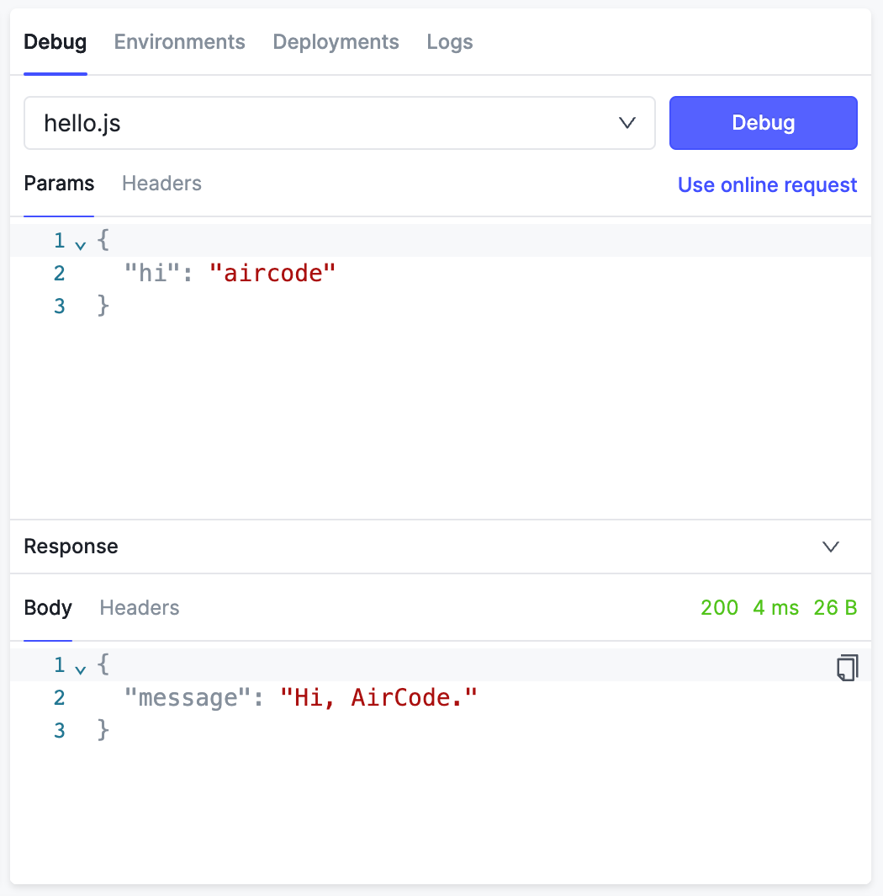
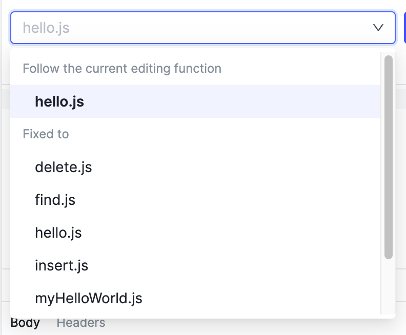
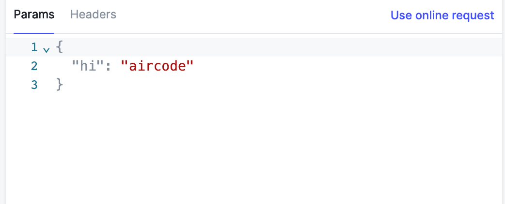
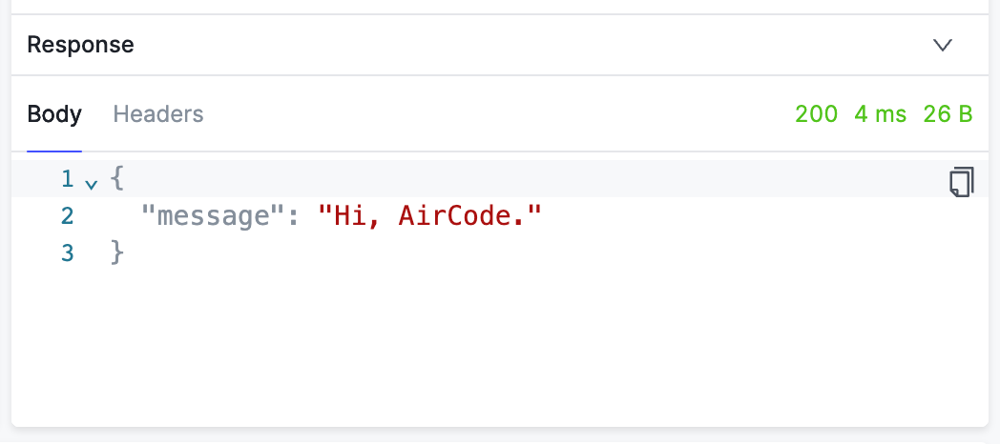

# 在线调试云函数 {#intro}

调试时开发中必不可少的部分。我们提供了一套方便和易用的在线调试工具，帮助你快速获取开发中函数的运行结果，高效迭代。

## 调试入口 {#entry-file}

在应用开发页面，调试工具位于右方功能区的「Debug」标签页中。选择入口函数后，点击「Debug」按钮即可向该函数发起一次请求。

入口函数分为两种类型：
- **随当前编辑变化**，即入口为当前正在编辑的函数，适合用来调试单独的函数逻辑
- **固定入口**，即入口固定为某个函数，不随切换编辑函数而变化，适合用来调试单一入口的一系列函数组合逻辑，如 Webhook

## 测试数据 {#request-data}

发起调试请求时，可以携带「Params」和「Headers」作为测试数据。

### Params {#request-data-params}

在「Params」区域内的数据会在调试时作为请求参数被携带，可以从函数中通过 `params` 参数获取。调试参数必须是 **JSON** 类型。

### Headers {#request-data-headers}

在「Headers」区域中的内容会作为请求头被携带，可以从函数中通过 `context.headers` 获取。请求头是键值对的形式，其值一定为 `string` 类型，更多可参考：[获取请求头和方法](/guide/functions/request-header-and-method.html)。

## 调试结果和日志 {#response-and-logs}

调试请求发送后，函数运行返回的结果可以在「Debug」标签页下方的「Response」区域中查看，包括响应体、响应头、状态码、响应时间等信息。

另外，函数中通过 `context.log` 打印的日志，会在编辑器下方的「日志」区域中输出。

## 使用线上请求调试 {#use-online-requests}

有时候，我们希望直接使用线上真实的请求参数来调试，以此复现一些线上场景并进行修改，这在排查线上问题、调试 Webhook 或者对接 OAuth 时尤其重要。

在 AirCode 中，点击「Debug」标签页中的「Use online requests」，在弹出的对话框中选择一条近期的请求，即可将测试数据中的 Params 和 Headers 都替换为这次真实线上请求中的值。

::: tip 安全提示
在提供极致的开发体验同时，AirCode 团队也非常重视用户的数据隐私和安全。对于每个函数的线上请求，我们仅缓存最近 5 条 `content-type: application/json` 格式的数据用于调试，所有请求数据会加密存储，并在 15 天后永久删除。
:::
